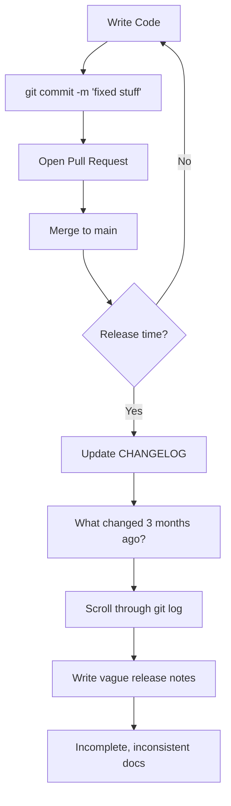
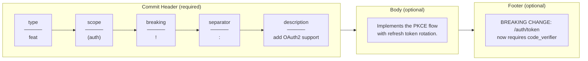
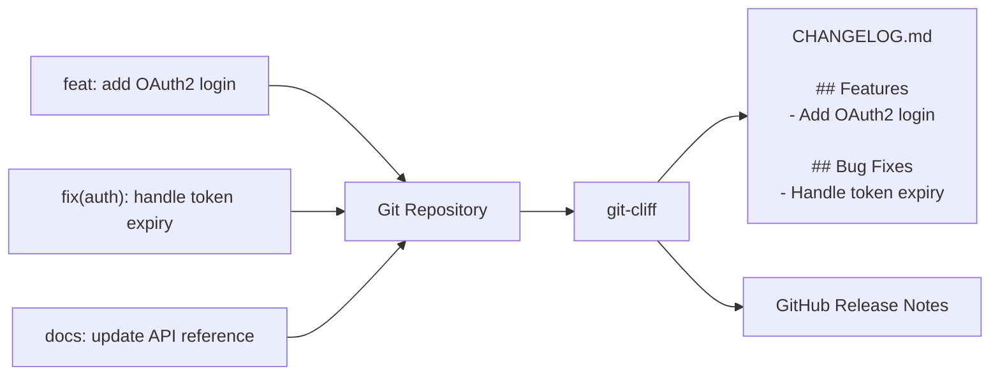
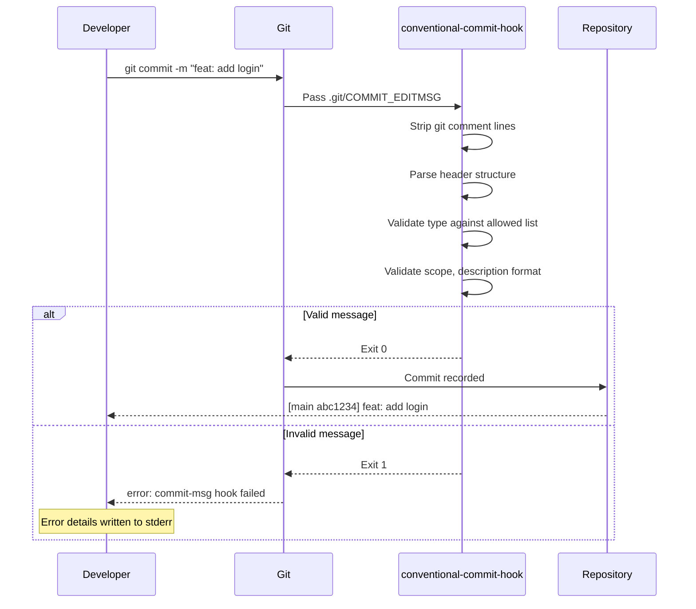
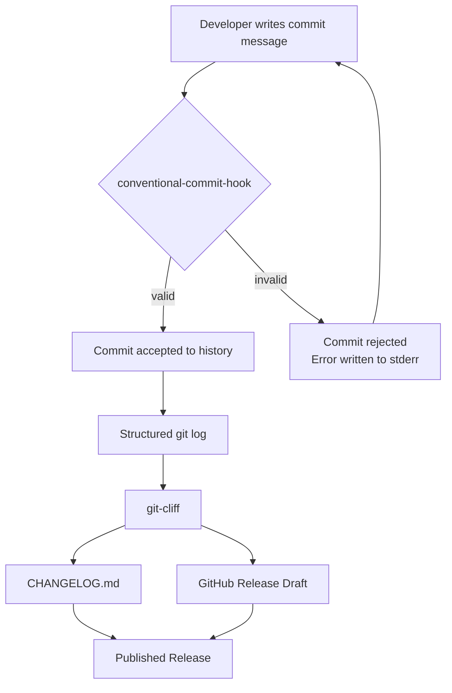
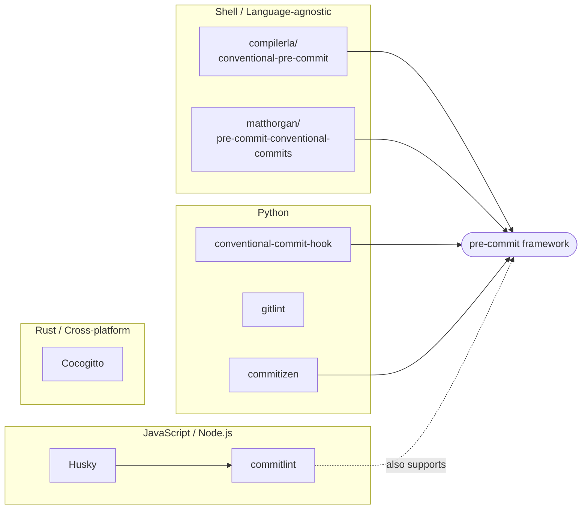

# From Commit Messages to Automated Changelogs: Why I Built a Conventional Commit Hook for Python

Most developers have a complicated relationship with changelogs.

We know they're valuable. Users appreciate them. Future maintainers rely on them. Yet maintaining them consistently is often one of the first things to fall by the wayside when a project gets busy.

After working on multiple software projects, I found myself asking a simple question:

> What if the Git commit history itself could become the source of truth for changelogs and release notes?

That question led me down the path of [Conventional Commits](https://www.conventionalcommits.org/), automated changelog generation with tools like [git-cliff](https://git-cliff.org/), and ultimately to building my own Python project: [`conventional-commit-hook`](https://github.com/millsks/conventional-commit-hook).

This article explores why Conventional Commits matter, how they enable automated changelog generation, the alternatives that exist, and what motivated me to create a new commit message validation hook for Python projects.

## The Problem with Traditional Changelogs

Many teams still maintain changelogs manually.

A typical release workflow looks something like this:



The problem is that the final step is often forgotten, and when it isn't, the context for each change has long since evaporated from memory.

Over time, changelogs become:

- Incomplete
- Inconsistent
- Outdated
- Difficult to maintain

Meanwhile, Git already contains a detailed record of every change that occurred throughout the project's history. The challenge isn't collecting information — it's transforming that information into structured release documentation.

That's where [Conventional Commits](https://www.conventionalcommits.org/) enter the picture.

## Enter Conventional Commits

The [Conventional Commits specification](https://www.conventionalcommits.org/en/v1.0.0/) defines a standard format for commit messages.

Instead of writing something like:

```text
fixed login bug
```

You write:

```text
fix(auth): resolve null pointer exception during login
```

Or:

```text
feat(api): add OAuth2 authentication support
```

Or:

```text
feat!: remove legacy v1 endpoints
```

Each commit message follows a structured format that communicates important metadata at a glance.

### Anatomy of a Conventional Commit



The metadata encoded in each commit:

- **type** — the category of change (`feat`, `fix`, `docs`, `refactor`, etc.)
- **scope** — which part of the codebase was affected (optional)
- **`!`** — signals a breaking change directly in the header (optional)
- **description** — a concise summary in the imperative mood
- **body** — detailed context about the change (optional)
- **footers** — structured metadata including `BREAKING CHANGE` (optional)

### The 11 Standard Types

The [Conventional Commits specification](https://www.conventionalcommits.org/en/v1.0.0/#specification) defines the `feat` and `fix` types explicitly, with `BREAKING CHANGE` as a special footer. The broader ecosystem has converged on 11 commonly used types:

| Type | Purpose |
|---|---|
| `feat` | A new feature |
| `fix` | A bug fix |
| `docs` | Documentation only changes |
| `style` | Formatting, whitespace — no logic change |
| `refactor` | Code restructure without a feature or fix |
| `perf` | A performance improvement |
| `test` | Adding or fixing tests |
| `build` | Build system or external dependency changes |
| `ci` | CI configuration changes |
| `chore` | Maintenance and housekeeping |
| `revert` | Reverts a previous commit |

## Turning Commit History into Changelogs

One of the most compelling tools in the Conventional Commits ecosystem is [git-cliff](https://git-cliff.org/).

Rather than manually maintaining release notes, [git-cliff](https://git-cliff.org/) analyzes commit history and generates changelog entries directly from commit messages.



The benefits are significant:

- Automated changelog generation tied directly to commit history
- Consistent release notes with zero manual effort
- Accurate historical records with proper categorization
- Faster release preparation
- Breaking changes surfaced automatically from `BREAKING CHANGE` footers

But this pipeline only works if the commit messages themselves are structured correctly. A single unformatted commit breaks the pattern. That's why enforcement at commit time matters.

## How the Pre-commit Hook Fits In

The [pre-commit](https://pre-commit.com/) framework provides a standardized way to run checks before a commit is accepted. A `commit-msg` hook runs after the developer writes a commit message but before Git records the commit permanently.



The hook catches formatting problems immediately, before they accumulate in history and before a developer has moved on to the next task.

## The Full Commit-to-Release Pipeline

Putting the pieces together, a project using Conventional Commits, [pre-commit](https://pre-commit.com/), and [git-cliff](https://git-cliff.org/) gets an end-to-end pipeline from commit message to release documentation:



Each step is automated. The only human input required is writing a well-formed commit message — something the hook enforces at the point of commit.

## The Open Source Ecosystem: Alternatives and Prior Art

[`conventional-commit-hook`](https://github.com/millsks/conventional-commit-hook) is [MIT licensed](https://github.com/millsks/conventional-commit-hook/blob/main/LICENSE) and fully open source — contributions, forks, and adaptations are welcome. It is one of several tools in a healthy ecosystem that addresses the same problem from different angles.

### Tools in This Space

The open source community has built commit message validators across multiple language ecosystems. Choosing the right tool depends on which ecosystem you work in, how you manage git hooks, and how much flexibility you need.

| Tool | Runtime | Hook mechanism | Focus |
| --- | --- | --- | --- |
| [conventional-commit-hook](https://github.com/millsks/conventional-commit-hook) | Python | [pre-commit](https://pre-commit.com/) | Validates against the full Conventional Commits spec |
| [commitlint](https://commitlint.js.org/) | Node.js | [Husky](https://typicode.github.io/husky/) / pre-commit | Highly configurable JS linter with plugin ecosystem |
| [compilerla/conventional-pre-commit](https://github.com/compilerla/conventional-pre-commit) | Shell | [pre-commit](https://pre-commit.com/) | Regex-based, language-agnostic |
| [pre-commit-conventional-commits](https://github.com/matthorgan/pre-commit-conventional-commits) | Python | [pre-commit](https://pre-commit.com/) | Python validator, prior art for this project |
| [gitlint](https://jorisroovers.com/gitlint/) | Python | pre-commit / standalone | Flexible rule-based linter |
| [Cocogitto](https://docs.cocogitto.io/) | Rust | Standalone binary | All-in-one: lint + changelog + versioning |
| [commitizen](https://commitizen-tools.github.io/commitizen/) | Python | pre-commit | Interactive commit builder + version bumping |



### The Node.js Ecosystem: commitlint + Husky

The most widely adopted combination in JavaScript projects is [commitlint](https://commitlint.js.org/) paired with [Husky](https://typicode.github.io/husky/). Commitlint is highly configurable — teams add `@commitlint/config-conventional` to enforce the same Conventional Commits rules, and Husky manages the git hook wiring. It is the de facto standard for Node.js monorepos and frontend projects.

For Python projects, pulling in a Node.js runtime solely to validate commit messages is an uncomfortable dependency. That friction motivates a Python-native alternative.

### The Python Landscape

[gitlint](https://jorisroovers.com/gitlint/) is a flexible, rule-based Python commit message linter. It supports custom rules and works well as a general-purpose linter, but enforcing the full Conventional Commits spec requires additional configuration rather than being available out of the box.

[commitizen](https://commitizen-tools.github.io/commitizen/) takes a different angle: instead of validating a message after the developer types it, it guides the developer through an interactive prompt to construct a valid commit. It also handles version bumping tied to commit types. It is a richer tool but changes the commit workflow more significantly and requires more setup.

### The Rust-Based All-in-One: Cocogitto

[Cocogitto](https://docs.cocogitto.io/) (`cog`) is a Rust-based toolchain that handles linting, changelog generation, and semantic versioning in a single binary. It is cross-platform and fast. If you want one tool that owns the entire Conventional Commits workflow without wiring together `pre-commit` + `git-cliff` separately, Cocogitto is worth evaluating.

### Prior Art: matthorgan's pre-commit-conventional-commits

One important influence on this project is [`pre-commit-conventional-commits`](https://github.com/matthorgan/pre-commit-conventional-commits) by matthorgan. It demonstrated that commit message validation could be delivered as a focused [pre-commit](https://pre-commit.com/) hook for Python projects without heavy dependencies — the same model that `conventional-commit-hook` follows.

Development activity on that project had slowed by the time I started building this, which is common for stable open source tools that reach feature completeness. That wasn't a criticism — it was the gap I wanted to fill with an actively maintained alternative.

## Why I Built conventional-commit-hook

With all these alternatives available, the motivation behind [`conventional-commit-hook`](https://github.com/millsks/conventional-commit-hook) was specific: I wanted a lightweight, actively maintained commit message validator designed for modern Python development workflows — one that installs cleanly from both [PyPI](https://pypi.org/project/conventional-commit-hook/) and [conda-forge](https://anaconda.org/conda-forge/conventional-commit-hook), fits naturally into the [pre-commit](https://pre-commit.com/) framework, and requires no Node.js or Rust toolchain.

Key design decisions:

- **Silent on success** — no output when the commit message is valid; noise only on failure
- **Single runtime dependency** — [`structlog`](https://www.structlog.org/) for structured, machine-parseable error output to stderr
- **Full spec support** — breaking change detection from both the `!` header marker and `BREAKING CHANGE` footer token
- **Custom type overrides** — the `--types` argument lets teams define their own allowed type set
- **Available on both [PyPI](https://pypi.org/project/conventional-commit-hook/) and [conda-forge](https://anaconda.org/conda-forge/conventional-commit-hook)** — fitting into conda-based Python workflows in addition to pip-based ones

## Using the Hook

Add it to your `.pre-commit-config.yaml`:

```yaml
repos:
  - repo: https://github.com/millsks/conventional-commit-hook
    rev: v0.1.0
    hooks:
      - id: conventional-commit-hook
```

Install the hook:

```sh
pre-commit install --hook-type commit-msg
```

To restrict the allowed types to a custom set:

```yaml
    hooks:
      - id: conventional-commit-hook
        args: [--types, feat, fix, hotfix, chore]
```

## Final Thoughts

[Conventional Commits](https://www.conventionalcommits.org/) introduce a small amount of discipline at commit time, but they unlock significant benefits throughout the software delivery lifecycle.

If changelogs are generated from commit history, then commit history needs to be reliable.

Git already records what changed. Conventional Commits explain why it changed. Tools like [git-cliff](https://git-cliff.org/) transform that information into meaningful release documentation. And a commit hook helps ensure the entire process remains consistent over time.

**GitHub Repository:** [https://github.com/millsks/conventional-commit-hook](https://github.com/millsks/conventional-commit-hook)
